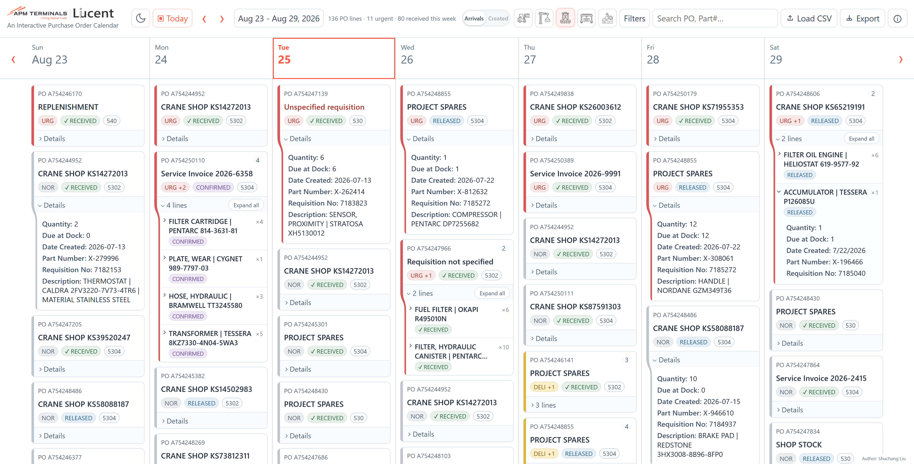
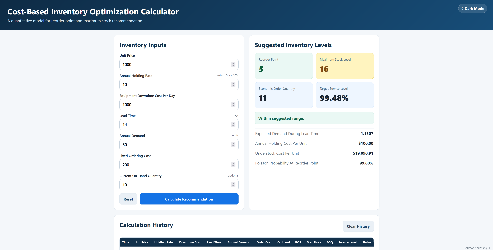
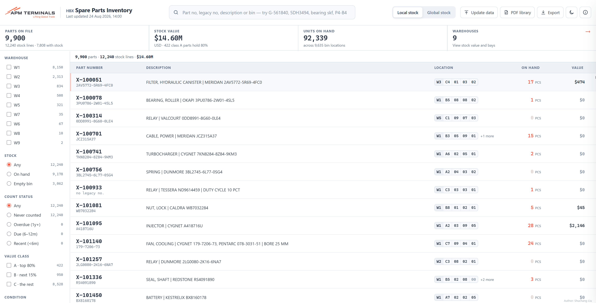
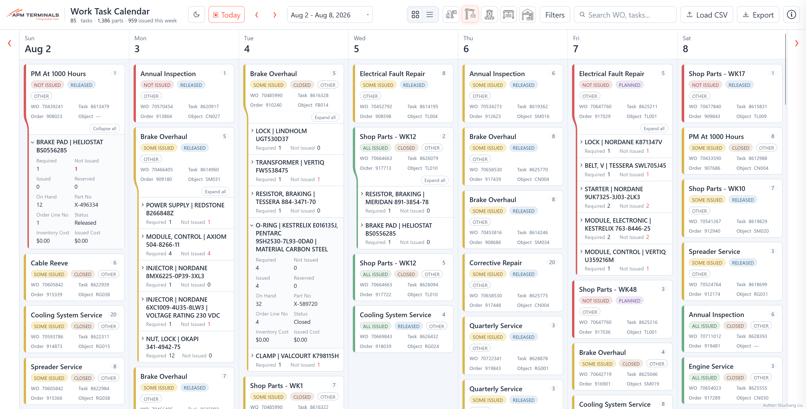

## Project Demos

Tools developed during the inventory internship to automate manual workflows and support decision-making. The demos below use anonymized data and run locally: all numbers, descriptions, and names were regenerated while preserving the original statistical characteristics.

**Click a header to launch each demo.**

---

### [ᐳ Liucent — Purchase Order Calendar](/projects/liucent.md)
Replaces manual requisition tracking with a calendar view of open purchase
orders by department and delivery urgency.

---

### [ᐳ Downtime-Sensitive Inventory Optimization Calculator](/projects/inventory-optimization-calculator.md)
EOQ, reorder point, critical-ratio, and Poison Distribution model for downtime-sensitive spare parts.

---

### [⮞ Spare Parts Finder](/projects/spare-parts-finder.md)
Warehouse inventory lookup across local shelves and a global network of 24 terminals. Cut part-lookup time from
10 minutes to under 1.

---

### [⮞ Work Task Calendar](/projects/work-task-calendar.md)
Maintenance work orders and their material requirements, by week, with
configurable cost-center mapping.

---

[Résumé (PDF)](pdf/resume.pdf) · [LinkedIn](https://linkedin.com/in/orly-liu)
